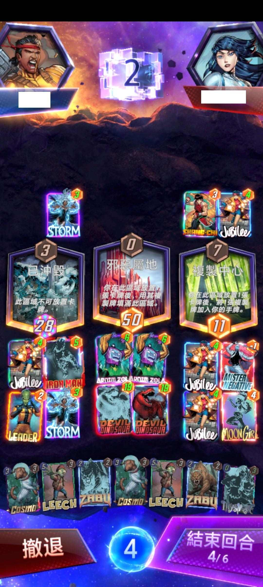

**Savage Land** and **Zola** in hand. We know playing it down might not win, but I'm incredibly curious about the result.

Therefore, I have simulated a scenario where it is played down for everyone:

Assume there is only one card in Lane 2 (let's treat it as a **Dragon** for now), and in Lane 1, **Savage Land** is played down with **Zola**. The remaining 3 lanes are completely empty.

### 🐉 Simulation Conclusions:

* **Perpetual Motion** (infinite loop) situations **do exist**, typically involving Zolas in Lane 2 and Lane 3 generating each other. This occurs about **25% of the time** (meaning there is at least a 25% chance of an guaranteed loss QQ).
* **Excluding the perpetual motion cases**, the average number of cards generated by Zola is about **30**, with a minimum of 17 and a maximum of 50. (So, the game will definitely enter fast-forward mode).
* An average of about **three Dragons** can be generated. Dragons in Lane 3 are relatively less likely to appear.

### 🎲 Conclusion of Conclusions:

Unless you are betting on a perfect draw (high-roll), **don't generally expect to SNAP first and then manage to generate a huge number of Dragons** this way.
